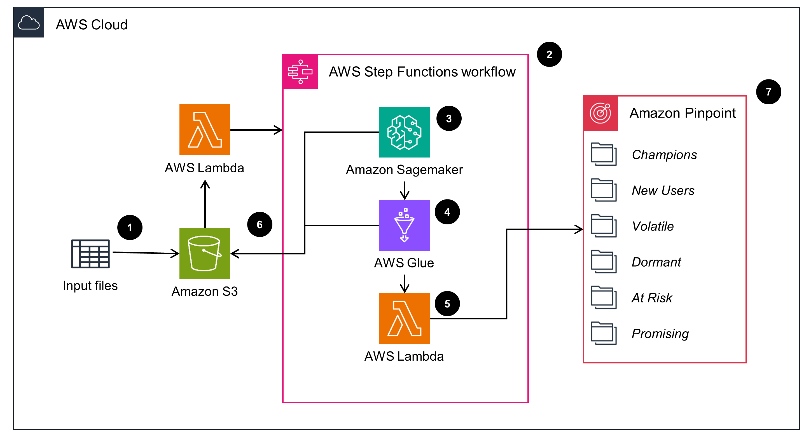

# Guidance for RFM Segmentation on Amazon Pinpoint

## Table of Contents
- Overview
- Cost
- Prerequisites
- Deployment Steps
- Deployment Validation
- Running the Guidance
- Next Steps
- Cleanup

## Overview
RFM (Recency, Frequency and Monetization) analysis and segmentation is an increasingly popular method to identify CLV (Customer Life Value), group customers cohorts and increase effectiveness of marketing strategies. Recency - How much time has elapsed since a customer’s last activity or transaction with the brand. Frequency - How often has a customer transacted or interacted with the brand during a particular period of time. Monetization - How much a customer has spent with the brand during a particular period of time.

AWS customers want to deploy ready-to-use predictive marketing solution that allows them to extract RFM based segmentation from end-user behavioral insights data, visualize these end-user categories on their Recency, Frequency, Monetary value and execute targeted communications to these cohorts.



The architecture for generating Recency, Frequency, Monetary (RFM) score based  segmentation consists of an input Amazon S3 bucket along with a AWS Lambda event trigger, an AWS Step Functions workflow and Amazon Pinpoint where the segmentation is created. Input files contain business-specific conversion events stored in Amazon S3, which uses AWS Lambda to trigger an AWS Step Functions workflow. The Step Functions workflow uses Amazon SageMaker, AWS Glue, AWS Lambda and Amazon S3 to generate RFM segment data that is ready to be uploaded into Amazon Pinpoint. Amazon SageMaker training and processing jobs use K-Means clustering to create RFM clustered data from the input source. AWS Glue uses the clustered data to create schema that is compatible with Amazon Pinpoint. Additionally, it merges columns from the input data sets to ensure schema compatibility with Amazon Pinpoint. AWS Lambda uploads the processed data into Amazon Pinpoint and also creates the RFM segments based on pre-defined rules for Recency, Frequency and Monetary scores. Amazon S3 stores the intermediate data from each step of the AWS Step Functions workflow. Amazon Pinpoint stores the final segmented data that can be used for targeted marketing communications. The architecture uses AWS CloudFormation (SAM) to build and deploy the solution to ensure repeatable and automated deployments. AWS IAM provides temporary security credentials for access to various AWS resources. 

## Prerequisites
The following prerequisites should be completed before deployment:

- Install [AWS Serverless Application Model (SAM)](https://aws.amazon.com/serverless/sam/) along with the [AWS CLI](https://docs.aws.amazon.com/cli/latest/userguide/getting-started-install.html) and [Docker](https://docs.docker.com/engine/install/).
- Ensure that your environment is configured with the correct [AWS credentials](https://docs.aws.amazon.com/cli/latest/userguide/cli-chap-configure.html).
- A new or existing Amazon Pinpoint [project](https://docs.aws.amazon.com/pinpoint/latest/developerguide/mobile-push-create-project.html) that will be used by this solution guidance.

### Supported Regions
The following regions are currently supported:
```
- us-west-1
- us-west-2
- us-east-1
- us-east-2
- ap-northeast-1
- ap-northeast-2
- ap-southeast-1
- ap-southeast-2
- ap-south-1
- eu-west-1
- eu-west-2
- eu-central-1
- ca-central-1
- us-gov-west-1
```

## Deployment Steps
- Clone the repository to your local environment and `cd` to the project root
```
git clone xxx
cd xxx
```
- Deploy the project 
```
./deploy.sh
``` 
- Answer the guided deployment questions
```
# Unique name for the CloudFormation Stack
stack_name = rfm-guidance-solution

# One of the supported regions listed above
region = ap-south-1

# Unique S3 bucket name. It will be created during deployment.
PinpointRFMS3BucketName = some-unique-bucket-name

# Pinpoint application ID as mentioned in prequisites.
PinpointRFMApplicationId = 1234567890qwertyuiop

# Retention period for logs in number of days
LOG_RETENTION_PERIOD = 365
```

## Deployment Validation
The deployment script displays the deployment status on the command line and success/error messages. To view further details, navigate to the AWS CloudFormation console and select the correct stack name.

## Running the Guidance

### Input Data
This guidance expects input data in the following format to be uploaded to the `BUCKET_NAME/uploads/` path. The `/uploads` path will not be present when uploading the input files for the first time, and should be created. 

| EventName | ProductCode                      | ProductName | ProductDescription                                | UnitPrice | Quantity | CustomerID                       | Username | ChannelType | Address        | City             | State      | Country | Date                            |
|-----------|----------------------------------|-------------|---------------------------------------------------|-----------|----------|----------------------------------|----------|-------------|----------------|------------------|------------|---------|---------------------------------|
| PURCHASED | 5efcc6957a8342818cf7ad1beb332125 | Venus Hub   | ainetututadetatidetutinabeauteteteteteteteaidetet | 1531.10   | 1        | fdb49669f5c84de8b3530675e1e299e1 | nasir    | EMAIL       | kade@yahoo.com | Austynport       | Wyoming    | PNG     | Mon, 19 Sep 2022 12:16:01 +0530 |
| VIEWED    | cbc0fc7235ef421e8ea9de9fd7a746bf | App Door    | ainetututadetatidetutinabeauteteteteteteteaidetet | 11123.10  | 8        | 24ed1df769ad49bfa76c71618e1459c5 | kayli    | SMS         | 55610746394    | Port Karelleland | Washington | NZL     | Sun, 29 May 2022 15:00:52 +0530 |

- The `EventName` attribute can be `VIEWED`, `PROCESSED` or `PURCHASED`.
- The input file should be in `CSV` format.

### Usage
Once the solution is deployed successfully and the input file is ready, follow the steps below to use the solution:
- Upload the input file to the `BUCKET_NAME/uploads/` folder (The `/uploads` path will not be present when uploading the input files for the first time, and should be created). This will trigger the AWS Step Functions workflow.
- Navigate to AWS Step Functions console and click on the `PinpointRFMStateMachine-*` state machine to view execution details.
- To view details on the individual steps, navigate to the Amazon Sagemaker, AWS Glue or AWS Lambda, Amazon Pinpoint console.
- After the AWS Step Functions workflow is completed, you can navigate to the Amazon Pinpoint console, select the Project you had chosen during deployment and click on `Segments` to view the RFM based segments that are created. All RFM segments created by this solution will be prefixed with `_RFM_`.

## Next Steps

## Cleanup
This solution deploys multiple AWS resources that incur costs. You can delete the solution by running `sam delete` on the root directory of the project. Any resources that are not deleted by AWS SAM should be removed manually to avoid incurring costs.

- Amazon S3 bucket will not be deleted automatically when you delete stack; it should be manually deleted if required.
- Amazon Pinpoint project (that was created manually) will not be deleted automatically; it should be manually deleted if required.

## Authors
- [Rajdeep Tarat](https://github.com/rajdeeptarat)
- [Satyasovan Tripathy](https://github.com/satyaso)
- [Sushant Moon](https://github.com/sushantMoon)